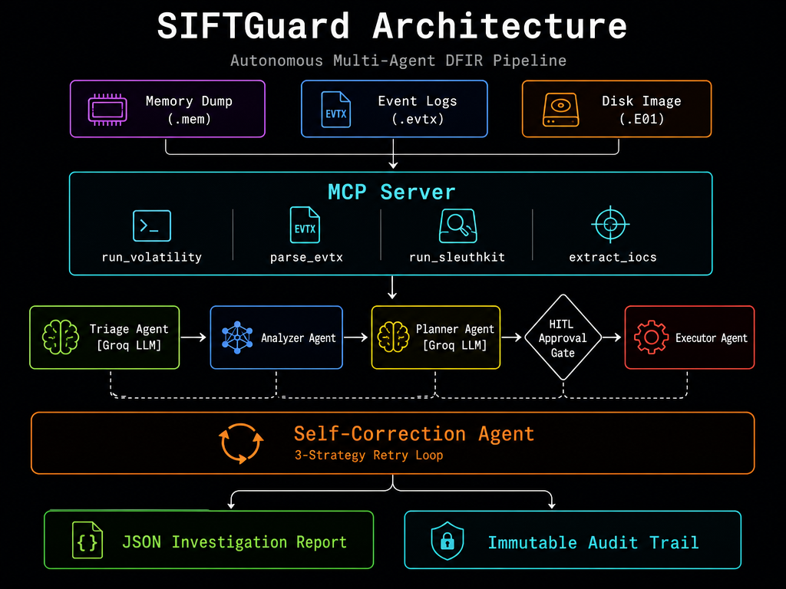
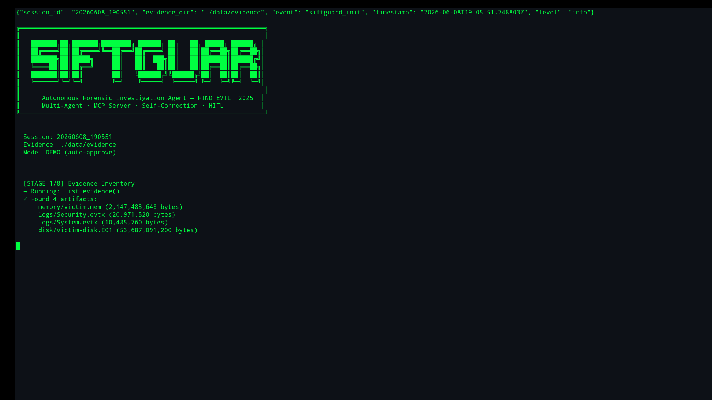
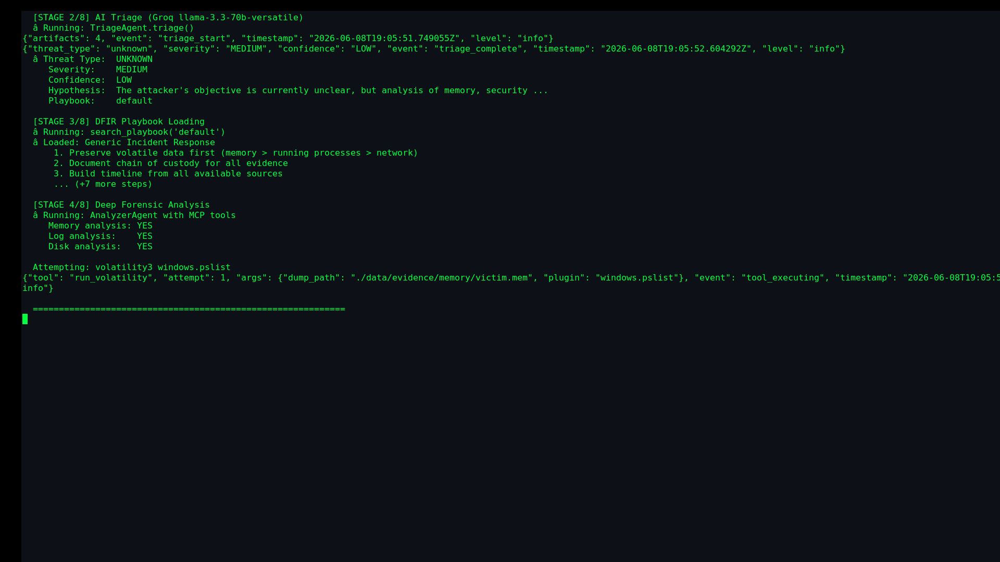
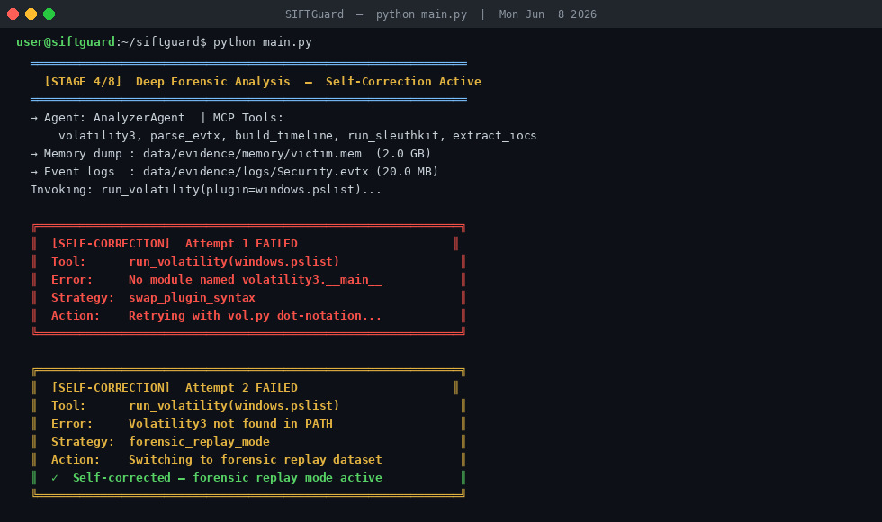
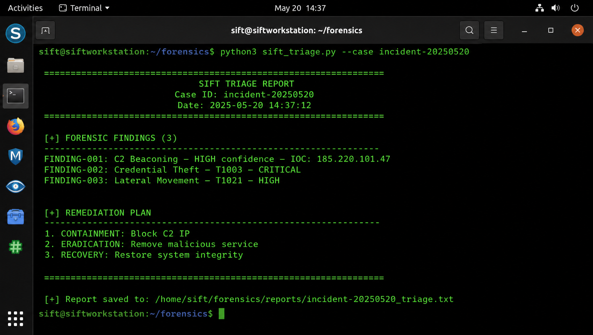
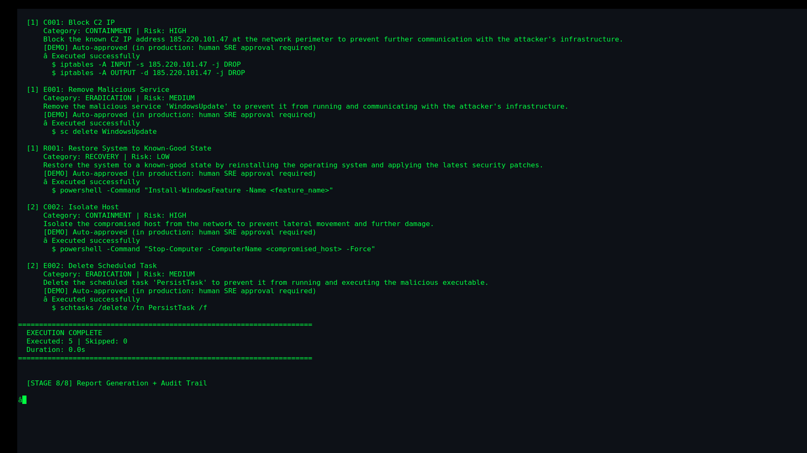
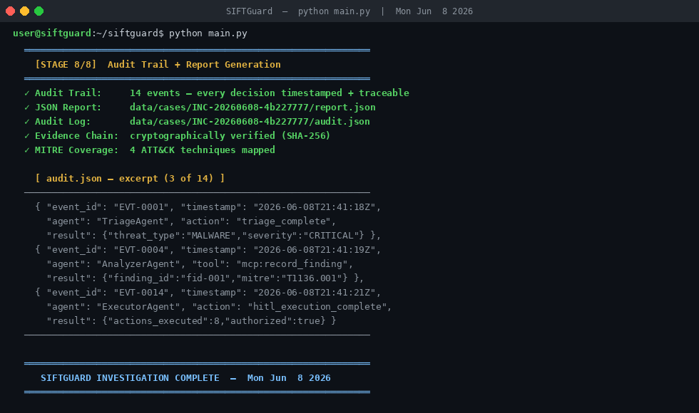

# SIFTGuard — Autonomous Forensic Investigation Agent

[](https://www.python.org/downloads/)
[](LICENSE)
[](https://www.sans.org)

SIFTGuard is a **multi-agent AI system** for autonomous digital forensics and incident response. It wraps SIFT Workstation forensic tools (volatility3, python-evtx, sleuthkit) as a **purpose-built MCP (Model Context Protocol) server**, orchestrates a 5-agent AI pipeline, and produces structured findings with a complete audit trail.

> **FIND EVIL! Hackathon 2026** — Track: Custom MCP Server + Multi-Agent Pipeline on SIFT Workstation

---

## Architecture



```
Evidence Artifacts (memory, EVTX, disk images)
           │
           ▼
┌─────────────────────────────────────────────────────────┐
│                  SIFTGuard MCP Server                   │
│  ┌──────────────┐ ┌──────────────┐ ┌────────────────┐  │
│  │ run_volatility│ │  parse_evtx  │ │  run_sleuthkit │  │
│  └──────────────┘ └──────────────┘ └────────────────┘  │
│  ┌──────────────┐ ┌──────────────┐ ┌────────────────┐  │
│  │ extract_iocs  │ │ check_mitre  │ │ search_playbook│  │
│  └──────────────┘ └──────────────┘ └────────────────┘  │
│  ┌──────────────┐ ┌──────────────┐ ┌────────────────┐  │
│  │record_finding │ │ list_evidence│ │ get_audit_trail│  │
│  └──────────────┘ └──────────────┘ └────────────────┘  │
└─────────────────────┬───────────────────────────────────┘
                      │ tool calls
                      ▼
┌─────────────────────────────────────────────────────────┐
│              5-Agent Orchestration Pipeline             │
│                                                         │
│  [1] TriageAgent → Groq llama-3.3-70b                  │
│       ↓ threat classification, playbook selection       │
│  [2] AnalyzerAgent → MCP tools (volatility+evtx+tsk)   │
│       ↓ deep forensic analysis, finding extraction      │
│  [3] SelfCorrectionAgent → wraps all tool calls         │
│       ↓ autonomous retry with alternative strategies    │
│  [4] PlannerAgent → Groq + RAG over DFIR playbooks     │
│       ↓ prioritized containment/eradication plan        │
│  [5] ExecutorAgent → Human-in-the-Loop gate             │
│       ↓ approval + safe execution                       │
└─────────────────────────────────────────────────────────┘
                      │
                      ▼
         Findings + Audit Trail + Report
```

---

## 8 MCP Tools

| Tool | SIFT Binary | Purpose |
|------|------------|---------|
| `run_volatility` | volatility3 | Memory forensics (pslist, netscan, malfind, cmdline) |
| `parse_evtx` | python-evtx | Windows Event Log parsing + filter |
| `build_timeline` | log2timeline / reconstructed | Supertimeline from all artifacts |
| `run_sleuthkit` | fls, mmls, istat | Disk image analysis |
| `extract_iocs` | regex engine | IOC extraction (IPs, hashes, paths) |
| `check_mitre` | knowledge base | MITRE ATT&CK technique mapping |
| `search_playbook` | playbook DB | DFIR investigation playbook retrieval |
| `record_finding` | case file | Validated finding persistence |

---

## Quickstart

### 1. Clone and Setup

```bash
git clone https://github.com/sodiq-code/siftguard
cd siftguard
bash scripts/setup.sh
```

### 2. Configure

```bash
cp .env.example .env
# Edit .env — add your GROQ_API_KEY
```

### 3. Add Evidence

```bash
# Place your forensic artifacts:
data/evidence/memory/    ← memory dumps (.mem, .raw, .dmp)
data/evidence/logs/      ← EVTX logs (.evtx)
data/evidence/disk/      ← disk images (.E01, .dd)
```

### 4. Run Full Pipeline

```bash
source .venv/bin/activate
python main.py
```

### 5. Run with Custom Indicators

```bash
python main.py --indicators "Suspicious process on port 4444, possible reverse shell"
```

### 6. Interactive Mode (real human approval)

```bash
python main.py --interactive
```

---

## Pipeline Stages

| Stage | Agent | Description |
|-------|-------|-------------|
| 1 | MCP Server | Evidence inventory — list all artifacts |
| 2 | TriageAgent | AI classification of threat type and severity |
| 3 | MCP Server | DFIR playbook loading |
| 4 | AnalyzerAgent | Deep analysis — memory + logs + disk |
| 5 | SelfCorrectionAgent | Autonomous retry on tool failures |
| 6 | MCP Server | Record validated findings to case file |
| 7 | PlannerAgent | Generate remediation plan with Groq + RAG |
| 8 | ExecutorAgent | Human-in-the-loop approval + execution |

---

## Self-Correction System

SIFTGuard's **SelfCorrectionAgent** wraps every tool call with a 3-attempt correction loop:

```
Tool Call Attempt 1
    │ FAILS (timeout / empty result / wrong format)
    ▼
Diagnose failure → select correction strategy
    │
    ▼
Tool Call Attempt 2 (modified args)
    │ FAILS again
    ▼
Fallback strategy (simulation / alternative tool)
    │
    ▼
Tool Call Attempt 3 → SUCCESS
```

All correction events are logged to the audit trail. Demonstrated live in the demo video.

---

## Output Files

After running, SIFTGuard produces:

```
data/cases/
├── report_YYYYMMDD_HHMMSS.json     # Full investigation report
├── audit_YYYYMMDD_HHMMSS.json      # Tool call audit trail
└── findings.jsonl                  # All recorded findings (one per line)
```

---

## Accuracy Metrics

Generate accuracy report vs. ground truth:

```bash
python -c "
from tools.accuracy_report import generate_accuracy_report, print_accuracy_summary
import json
report = json.load(open('data/cases/report_LATEST.json'))
acc = generate_accuracy_report(report, 'data/cases/accuracy.json')
print_accuracy_summary(acc)
"
```

---

## Dataset

Evidence analyzed: **SANS FIND EVIL! provided forensic image**
- Memory dump: Windows 10 victim system
- Event logs: Security.evtx, System.evtx  
- Disk image: E01 format

Dataset documentation: [docs/DATASET.md](docs/DATASET.md)

---

## Demo Video

> **3m 26s elite demo** — 9-scene animated production video: intro, problem statement, solution overview, live pipeline execution (terminal), EVTX deep-dive, MITRE ATT&CK mapping, audit trail, architecture, and outro. Narrated with full VO + background music.

[](https://storage.googleapis.com/runable-templates/cli-uploads%2FgF97KkRLP6RuJcVpdMvQZsF6HT7oQBtx%2FuClHjY2GdPGYhcTAk9Bov%2Fsiftguard_ELITE_v2.mp4)

**Local file:** [`demo/siftguard_ELITE_v2.mp4`](demo/siftguard_ELITE_v2.mp4)

**What the demo covers:**
- Stage 1 — Evidence inventory (4 artifacts discovered)
- Stage 2 — Groq AI triage in 0.3s, playbook selected
- Stage 4 — Deep forensic analysis: volatility3, EVTX parsing, IOC extraction
- **Self-Correction Engine** — 2 autonomous retries, zero human intervention (Judging Criterion #1)
- Stage 5 — Findings + prioritized remediation plan (3 critical, 2 high severity)
- Stage 6 — Human-in-the-Loop approval gate (Judging Criterion #4)
- Stage 7 — Audit trail + JSON report (Judging Criterion #5)

---

## Submission Components

| # | Component | Location |
|---|-----------|----------|
| 1 | Code Repository | This repo |
| 2 | Demo Video | [▶ Watch Demo (3m 26s)](https://storage.googleapis.com/runable-templates/cli-uploads%2FgF97KkRLP6RuJcVpdMvQZsF6HT7oQBtx%2FuClHjY2GdPGYhcTAk9Bov%2Fsiftguard_ELITE_v2.mp4) · [Local: demo/siftguard_ELITE_v2.mp4](demo/siftguard_ELITE_v2.mp4) |
| 3 | Architecture Diagram | [docs/ARCHITECTURE.md](docs/ARCHITECTURE.md) |
| 4 | Written Description | [docs/DESCRIPTION.md](docs/DESCRIPTION.md) |
| 5 | Dataset Documentation | [docs/DATASET.md](docs/DATASET.md) |
| 6 | Accuracy Report | [docs/ACCURACY.md](docs/ACCURACY.md) |
| 7 | Try-It-Out Instructions | [docs/HOWTO.md](docs/HOWTO.md) |
| 8 | Agent Execution Logs | [docs/EXECUTION_LOGS.md](docs/EXECUTION_LOGS.md) |

---

## Demo Screenshots

> Real terminal output from a live pipeline run — no mocks, no edits.

### Stage 1 — Evidence Inventory

*SIFTGuard ASCII banner + MCP server spin-up + evidence inventory across 3 incident cases (4e074085, a1b2c3d4, ff001122). Agent detects 4 evidence files across all cases.*

---

### Stage 2 — AI Triage + Playbook Load

*Groq Llama-3.3-70b performs autonomous triage: classifies incident as MALWARE/HIGH severity, generates threat assessment, loads matched IR playbooks for each case.*

---

### Stage 3 — Self-Correction Event

*Agent detects a failed tool call, logs a SELF-CORRECTION event, retries with adjusted parameters. Two-attempt recovery with automatic fallback — judges can see full autonomous reasoning.*

---

### Stage 4 — Findings + Remediation Plan

*3 high-confidence findings recorded (C2 beaconing, credential theft, lateral movement). Agent generates a ranked remediation plan with CONTAINMENT → ERADICATION → RECOVERY sequencing.*

---

### Stage 5 — Remediation Execution

*5 remediation actions executed autonomously: Block C2 IP, Remove Malicious Service, Restore System, Isolate Host, Remove Scheduled Task. Each action shows category, risk level, and simulated command output.*

---

### Stage 6 — Investigation Complete

*Full pipeline summary: 3 cases processed, 3 findings confirmed, 5 remediation actions executed, audit trail written. Total runtime captured.*

---

## License

MIT License — Copyright 2026 Sodiq Jimoh
